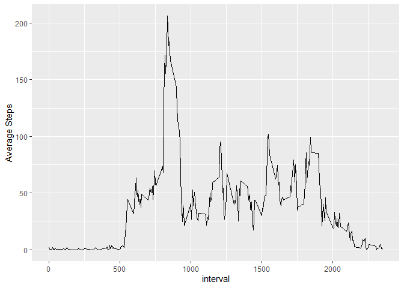
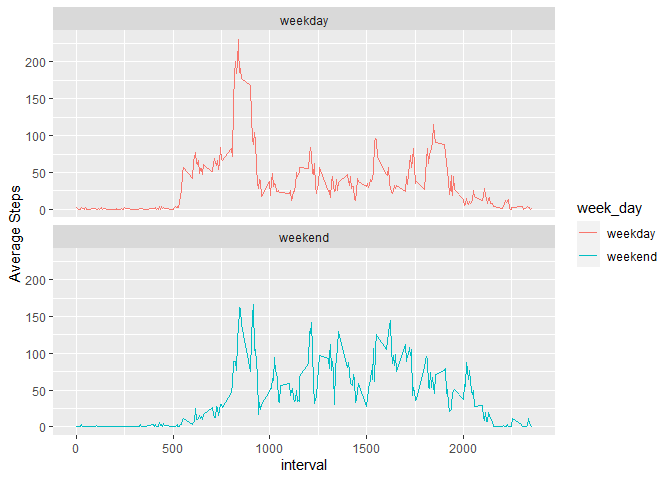

## Loading and preprocessing the data\

The following code chunk prepares the data.

```r
## Loads some useful packages for the upcoming process.

library(tidyverse)

## Check if data folder exists. If not, create one.

if(!file.exists("./data")){
      dir.create("./data")
}

## Check if dataset file already exists within the data folder. If not, download and unzip it.

if(!file.exists("./data/activity.csv")){
      file_url <- "https://d396qusza40orc.cloudfront.net/repdata%2Fdata%2Factivity.zip"
      download.file(file_url, destfile = "./data/activity.zip", method = "curl")
      unzip("./data/activity.zip", exdir = "./data")
}

## Read the activity.csv dataset and store it into the activity variable

activity <- read_csv("./data/activity.csv")
```
\

## What is mean total number of steps taken per day?\

Subset and summarize the original data to calculate the sum of steps taken per day, ignoring missing values.

```r
## Subset and Summarize with the dplyr package
activity_by_day <- activity %>%
      filter(!is.na(steps)) %>% ## ignore missing values in the dataset
      group_by(date) %>%
      summarize(total_steps = sum(steps, na.RM  = TRUE))
```
\

With the summarized data frame, generate a histogram of total steps taken per day.

```r
## Histogram creates with the ggplot2 package
ggplot(activity_by_day) +
      geom_histogram(mapping = aes(total_steps))
```

<!-- -->
\
\

Finally, calculate the mean and median of steps taken per day.

```r
## Calculates the measurements
total_steps_mean <- mean(activity_by_day$total_steps)
total_steps_median <- median(activity_by_day$total_steps)

## Format string for printing
formatted_mean <- format(total_steps_mean, big.mark = ",", nsmall = 2L)
formatted_median <- format(total_steps_median, big.mark = ",", nsmall = 2L)
```

The **mean** total per day is **10,767.19** and the **median** is **10,766.00**.\

## What is the average daily activity pattern?\

Subset the original data, grouping it by interval, calculate the mean total steps across all days for each interval and create a time series line plot.

```r
## Subset, group and summarize the data
activity_by_interval <- activity %>%
      group_by(interval) %>%
      summarize(interval_mean = mean(steps, na.rm = TRUE))

## Create the time series line plot
ggplot(activity_by_interval) + 
      geom_line(mapping = aes(x = interval, y = interval_mean)) +
      ylab("Average Steps")
```

<!-- -->
\
\

Calculates the interval which, on average across all days, contains the maximum number of steps.

```r
## Get a vector containing the highest steps average along with its respective interval
interval_max_step <- slice_max(activity_by_interval, interval_mean, n = 1)
interval_minute <- interval_max_step$interval
interval_avg <- format(interval_max_step$interval_mean, digits = 2, nsmall = 2L)
```

The interval with the highest average total steps is the **835** minute interval, with an average of **206.17** steps.\

## Imputing missing values\

Calculates the total number of missing values in the original dataset.

```r
num_NA <- sum(!complete.cases(activity))
```
The total number of missing values int he original dataset is **2304**.
\
\

Fill the missing values observations with the 5-minute interval mean across all days for that interval, creating a dataset with the same dimensions of the original, but without NA's.

```r
activity_wo_na <- activity %>%
      group_by(interval) %>%
      mutate(interval_mean = mean(steps, na.rm = TRUE)) %>%
      ungroup() %>%
      mutate(steps = if_else(is.na(steps), ceiling(interval_mean), steps))
```
\

With the newly created dataset, group it by date, summarize it by the total steps per day and create a histogram out of it.

```r
## Subset, group and summarize the data
activity_wo_na_by_day <- activity_wo_na %>%
      group_by(date) %>%
      summarize(total_steps = sum(steps))

## Create the histogram
ggplot(activity_wo_na_by_day) +
      geom_histogram(mapping = aes(total_steps))
```

<!-- -->
\
\

Calculate the mean and median for the new dataset without the missing values and compare it to the original results.

```r
## Calculate mean and median
steps_wo_na_mean <- mean(activity_wo_na_by_day$total_steps)
steps_wo_na_median <- median(activity_wo_na_by_day$total_steps)

## Create a new data frame, comparing old and new results
comparison_df <- data.frame(
      with_na = c(mean = total_steps_mean, median = total_steps_median),
      without_na = c(mean = steps_wo_na_mean, median = steps_wo_na_median)
      )

mean_var <- format(with(comparison_df, without_na[1] / with_na[1]), digits = 2, nsmall = 2L)
median_var <- format(with(comparison_df, without_na[2] / with_na[2]), digits = 2, nsmall = 2L)

library(knitr)
kable(comparison_df, format = "html", table.attr = "style='width:30%;'", format.args = list(big.mark = ","))
```

<table style='width:30%;'>
 <thead>
  <tr>
   <th style="text-align:left;">   </th>
   <th style="text-align:right;"> with_na </th>
   <th style="text-align:right;"> without_na </th>
  </tr>
 </thead>
<tbody>
  <tr>
   <td style="text-align:left;"> mean </td>
   <td style="text-align:right;"> 10,767.19 </td>
   <td style="text-align:right;"> 10,784.92 </td>
  </tr>
  <tr>
   <td style="text-align:left;"> median </td>
   <td style="text-align:right;"> 10,766.00 </td>
   <td style="text-align:right;"> 10,909.00 </td>
  </tr>
</tbody>
</table>
\

The values slightly differ from the estimates from the first part of the assignment. As for the overall impact, the mean had an increase of 1.00% and the median had an increase of 1.01%.

## Are there differences in activity patterns between weekdays and weekends?\

Creates a new dataset, adding the factor variables 'weekday' and 'weekend' to the previously created dataset without the missing values.

```r
activity_week <- activity_wo_na %>%
      mutate(week_day = as.factor(if_else(weekdays(date, abbreviate = TRUE) %in% c("sáb", "dom"), "weekend", "weekday"))) %>%
      group_by(interval, week_day) %>%
      summarize(interval_mean = mean(steps, na.rm = TRUE))
```

```
## `summarise()` regrouping output by 'interval' (override with `.groups` argument)
```
\

Plot two time series line graphs comparing the mean of total steps in each interval for the weekday and weekend factors.

```r
ggplot(activity_week) + 
      geom_line(mapping = aes(x = interval, y = interval_mean, color = week_day)) + 
      ylab("Average Steps") +
      facet_wrap(~ week_day, nrow = 2)
```

<!-- -->

There is a difference between the weekday and weekend groups. On the weekday plot we can see a peak slightly above 225 steps between the 750 and 1,000 minute interval, and barely going over the 100 steps mark after the 1,000 minute interval. On the weekend plot we can see the steps ranging from 25 to about 150 between the interval of 750 and 1,750 minute.
